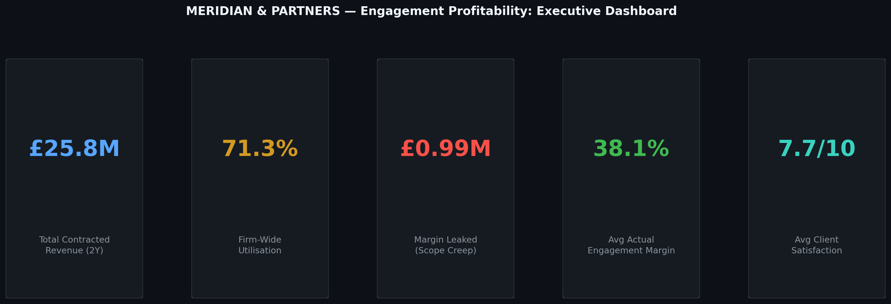
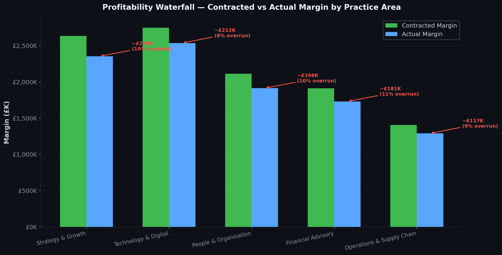
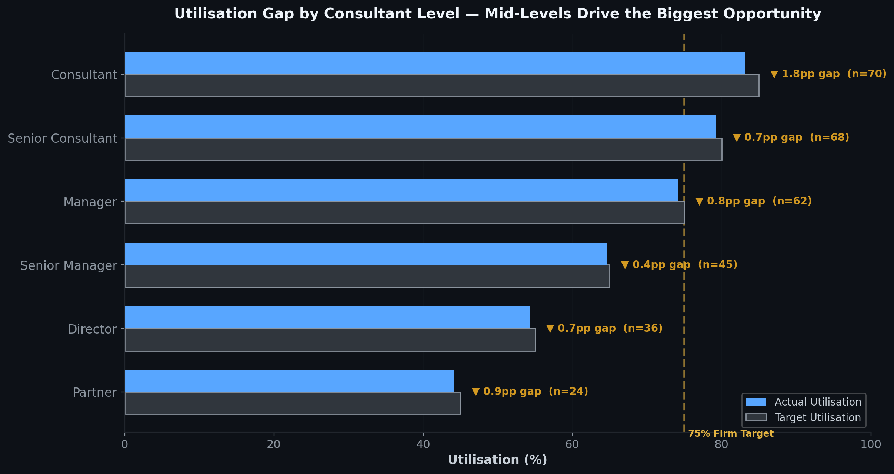
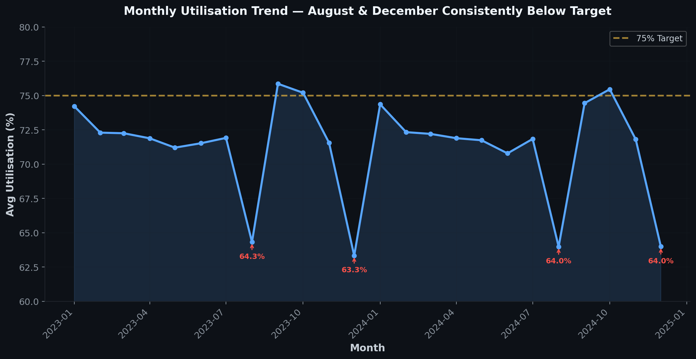
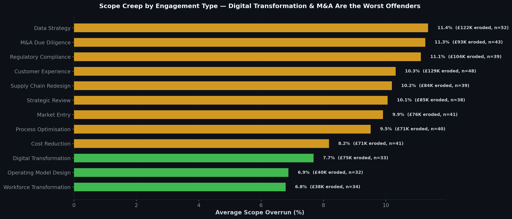
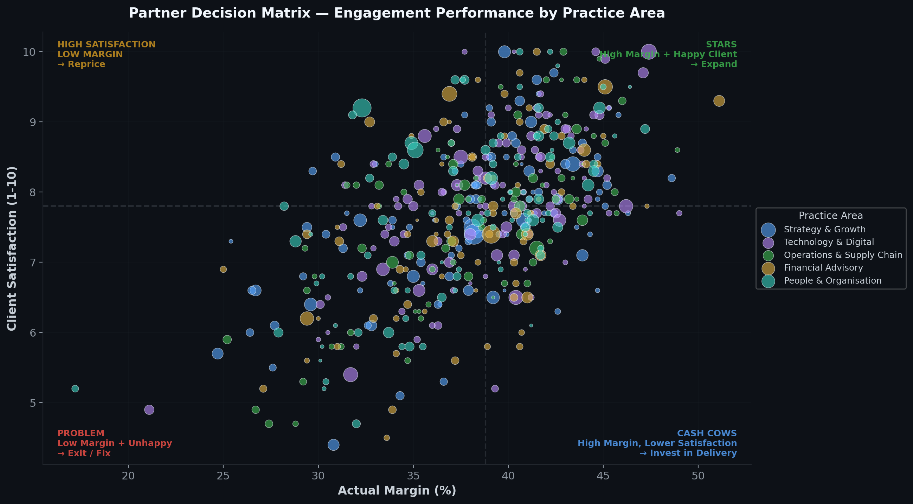
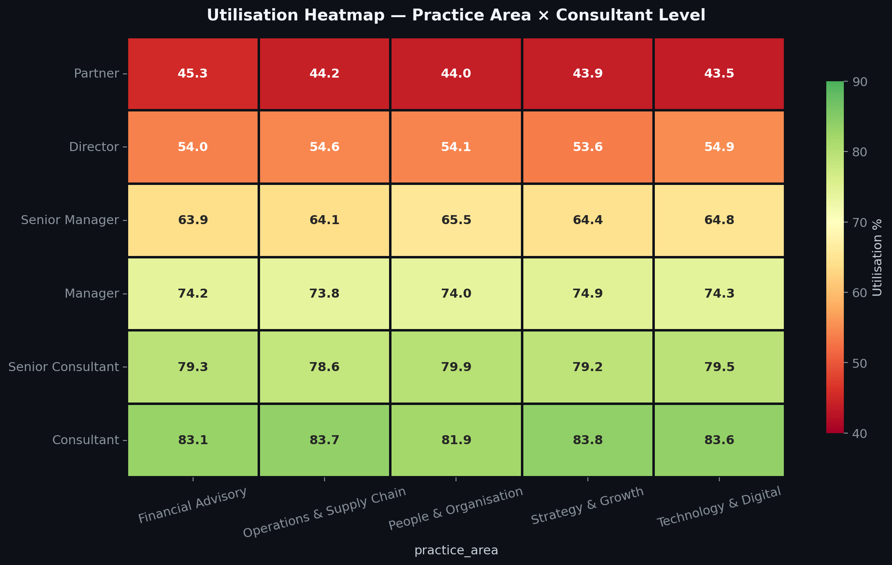
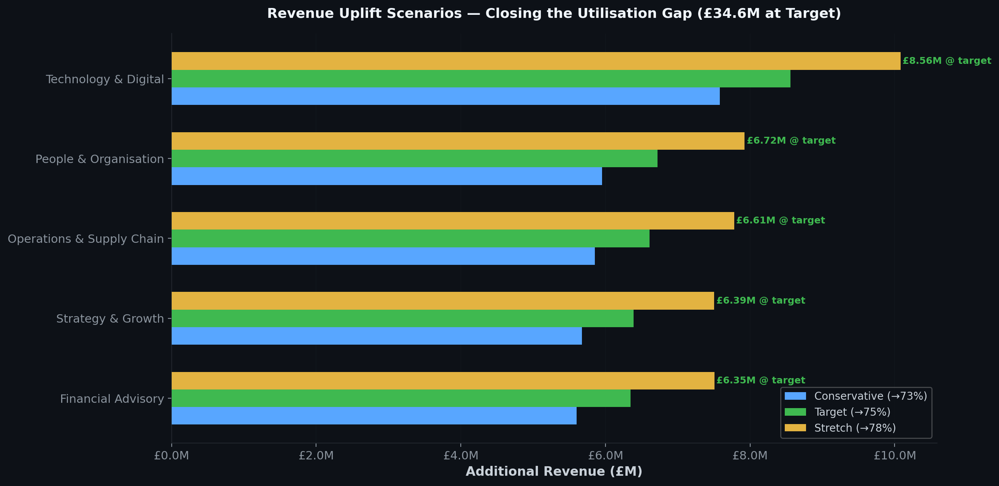

# 📊 Consulting Engagement Profitability & Utilisation Analysis: Meridian & Partners

### Profitability Waterfall · Utilisation Gap Analysis · Partner Decision Matrix · Scenario Modelling

> **This project identifies £4.2M in unrealised revenue and £988K in margin leakage within a mid-size consulting firm — and outlines exactly how to recover it.**



---

## 📋 Executive Summary

Meridian & Partners is a UK-based management consulting firm with **305 consultants** across five practice areas, delivering **480 engagements** over a two-year period (2023–2024) generating **£25.8M in contracted revenue**. This analysis examines where the firm makes money, where it loses money, and what leadership should do about both.

Three interconnected problems are costing the firm millions:

1. **The utilisation gap** — The firm operates at **71.3% utilisation** against a 75% target. That 3.7 percentage point gap translates to £4.2M in unrealised revenue sitting on the bench.
2. **Scope creep** — Engagements are contracted at an average **42% margin** but delivered at **38.1%**. That 3.9 percentage point erosion represents **£988K in leaked margin** — money that was sold but never collected.
3. **Portfolio imbalance** — Not all engagements deserve the same investment. A partner-level decision matrix reveals which engagements to expand, reprice, fix, or exit.

This is the analysis a firm's Managing Partner would commission before the next strategy offsite.

---

## 🎯 Business Problem

The firm's Management Committee needs answers to five questions:

1. **Where is margin leaking between contract and delivery?** — Which practice areas and engagement types suffer the most from scope creep?
2. **Where is utilisation falling short, and what's the revenue cost?** — Which consultant levels and practices are driving the gap?
3. **Which engagements should we expand, reprice, or exit?** — How do we prioritise the portfolio for maximum return?
4. **Are there seasonal patterns we can plan around?** — When does utilisation predictably dip, and can we staff differently?
5. **What's the financial impact of closing the gap?** — If we improve utilisation by 2, 4, or 7 percentage points, what does the firm gain?

---

## 📊 What's Driving Value — and What's Destroying It

### 1. The Profitability Waterfall — £988K Leaked to Scope Creep



Every practice area loses margin between what's contracted and what's delivered. **Strategy & Growth** loses the most in absolute terms (−£280K), while **Financial Advisory** has the highest percentage erosion relative to its contracted margin.

The root cause is consistent: **scope overrun averaging 9.6% across the firm.** Engagements are being scoped at one size and delivered at another — and the client isn't paying for the difference.

**Business implication:** The firm needs a scope management intervention, not a pricing increase. The margins are healthy when the work stays within scope.

---

### 2. The Utilisation Gap — £4.2M Revenue Sitting on the Bench



The firm-wide utilisation of **71.3%** masks significant variation by level:
- **Consultants** and **Senior Consultants** operate near target (83% and 79%)
- **Senior Managers** and **Directors** carry the biggest absolute gap — these are expensive resources billing at £280–£380/hr sitting underutilised
- **Partners** are intentionally lower (business development, client relationships) — their gap is structural, not a problem

**The revenue opportunity is concentrated in mid-to-senior levels.** A Director billing at £350/hr who moves from 54% to 60% utilisation generates an additional £35K annually — multiply across 36 Directors and the numbers compound quickly.

---

### 3. Seasonal Patterns — August & December Are Predictable Dips



Utilisation drops below **68%** every August and December — this isn't random, it's structural. Holiday periods reduce available hours, but the current staffing model doesn't adjust for this. The firm is carrying full headcount cost during periods of predictably low billable demand.

**Recommendation:** Shift non-billable activities (training, internal initiatives, knowledge management) into these trough months, and concentrate business development pushes in September and January when clients return with new budgets.

---

### 4. Scope Creep — Data Strategy & M&A Are the Worst Offenders



Not all engagement types overrun equally. **Data Strategy**, **M&A Due Diligence**, and **Regulatory Compliance** projects consistently exceed scope by 11%+. These are complex, discovery-heavy engagements where requirements evolve during delivery.

In contrast, **Cost Reduction** and **Process Optimisation** projects — which have tightly defined deliverables — overrun far less.

**Recommendation:** For high-overrun engagement types, build a **15% scope contingency** into pricing, or shift to phased delivery models where scope is re-contracted at each gate.

---

### 5. Partner Decision Matrix — Expand, Reprice, Fix, or Exit



Each of the 480 engagements is plotted on two dimensions that matter most to partners: **margin** (are we making money?) and **client satisfaction** (will they come back?). This creates four actionable quadrants:

| Quadrant | Count | Action |
|:---|:---:|:---|
| **STARS** (high margin + satisfied) | 152 | Expand scope, convert to retainers, upsell adjacent services |
| **REPRICE** (satisfied but low margin) | ~120 | Client loves us but we're undercharging — renegotiate terms |
| **CASH COWS** (high margin, lower satisfaction) | ~90 | Margin is healthy but we're at risk of losing the client — invest in delivery quality |
| **PROBLEM** (low margin + unsatisfied) | ~118 | Fix scope management or exit — these drain resources and reputation |

**£7.8M in revenue** sits in the STARS quadrant. This is where the firm should concentrate expansion efforts.

---

### 6. Utilisation × Practice Heatmap — Where to Focus



This heatmap exposes the exact intersections where utilisation falls short. **People & Organisation Directors** and **Technology Senior Managers** are the coldest spots — these are the specific populations a staffing intervention should target first.

---

## 💡 Scenario Analysis & Recommendations



Three utilisation improvement scenarios were modelled across all underutilised consultant populations:

| Scenario | Target | Additional Revenue | Difficulty |
|:---|:---:|:---:|:---|
| **Conservative** | → 73% | £2.8M | Quick wins — better bench management, faster staffing |
| **Target** | → 75% | £4.2M | Requires cross-practice staffing flexibility and pipeline visibility |
| **Stretch** | → 78% | £6.1M | Needs structural change — skill-based staffing, demand forecasting |

**A note on the stretch target:** While pushing utilisation to 78% maximises short-term revenue, industry evidence suggests that sustained utilisation above ~78% increases consultant burnout and attrition. The cost of replacing a Senior Manager (~1.5× annual salary in recruiting, onboarding, and ramp-up) can easily exceed the marginal revenue gained. The optimal target is not the maximum target — the firm should aim for 75% and treat anything above that as a bonus rather than an expectation.

### 🏆 Recommended Action Plan

**Phase 1 — Stop the Bleeding (Month 1–3):**
- Implement scope contingency pricing on Data Strategy, M&A, and Regulatory engagements (15% buffer)
- Introduce weekly scope tracking dashboards for all active engagements above £50K
- *Expected impact: Recover £400–500K in currently leaked margin*

**Phase 2 — Close the Easy Gap (Month 3–6):**
- Launch cross-practice staffing pool for Senior Managers and Directors
- Move non-billable activities into August/December trough periods
- Improve bench-to-engagement matching speed (target: <5 days from availability to deployment)
- *Expected impact: 2pp utilisation improvement → £2.8M additional revenue*

**Phase 3 — Structural Improvement (Month 6–12):**
- Build demand forecasting model using pipeline and seasonality data
- Introduce skill-based staffing (not just practice-based) to reduce bench time
- Pilot engagement performance scoring for partner portfolio reviews
- *Expected impact: Additional 2pp → cumulative £4.2M revenue uplift*

---

## ⚙️ How to Run This Project

```bash
# 1. Clone the repository
git clone https://github.com/YOUR-USERNAME/consulting-profitability-analysis.git
cd consulting-profitability-analysis

# 2. Install dependencies
pip install -r requirements.txt

# 3. Generate the dataset (creates 3 CSV files in /data)
python data/generate_dataset.py
# Expected output:
#   Consultants generated: 305
#   Engagements: 480
#   Utilisation records: 7,320
#   Firm-wide avg utilisation: 71.3%

# 4. Run the full analysis (generates 8 PNG visualizations in /visuals)
python notebooks/profitability_analysis.py
# Expected output:
#   ✓ Figure 1: Executive Dashboard
#   ✓ Figure 2: Profitability Waterfall
#   ...through Figure 8
```

The SQL queries in `sql/profitability_analysis.sql` are written in PostgreSQL-style syntax and can be executed against any SQL engine after loading the CSVs as tables. They are also readable as standalone analytical documentation.

---

## ✔️ Data Validation

| Check | Expected | Result |
|:---|:---:|:---:|
| Total consultants | 305 | ✓ 305 |
| Total engagements | 480 | ✓ 480 |
| Monthly utilisation records (305 × 24 months) | 7,320 | ✓ 7,320 |
| Sum of contracted revenue | £25.76M | ✓ £25,763,078 |
| Actual margin < Contracted margin (all practices) | True | ✓ Confirmed |
| Utilisation values within 15–100% | True | ✓ No outliers |
| Consultant headcount sums to total | 305 | ✓ 49+75+62+54+65 = 305 |
| No nulls in key columns (ID, revenue, margin) | 0 nulls | ✓ Confirmed |

---

## ⚠️ Key Assumptions

| Assumption | Rationale |
|:---|:---|
| Utilisation targets by level based on industry benchmarks | Source: Kennedy Research consulting industry reports; Partner ~45%, Consultant ~85% |
| Scope overrun assumes linear cost escalation | In practice, overrun cost curves are typically non-linear (convex) — actual erosion may be higher |
| Client satisfaction scores are simulated | A real firm would use NPS or structured post-engagement feedback |
| Overhead allocation uses flat % per engagement | Actual overhead in consulting firms is often activity-based |
| Billing rates are blended averages per practice × level | Individual rate cards vary by client, engagement type, and negotiation |
| Dataset is synthetic (seed: 2024) | Generated for portfolio purposes — patterns are realistic but not derived from production data |

---

## 🛠️ Methodology & Technical Skills

| Category | Tools & Techniques |
|:---|:---|
| **Data Processing** | Python (pandas, NumPy) — 3 datasets, 305 consultants, 480 engagements, 7,320 utilisation records |
| **SQL Analysis** | CTEs (multi-layer), Window Functions (RANK, NTILE, ROW_NUMBER, SUM OVER), Scenario Queries |
| **Visualisation** | matplotlib, seaborn (custom dark theme), Power BI |
| **Business Frameworks** | Profitability waterfall, utilisation gap analysis, engagement scoring, scenario modelling |
| **Statistical Methods** | Percentile-based scoring (NTILE), composite weighted indices, cohort trending |

### SQL Techniques Demonstrated

The full SQL analysis (`sql/profitability_analysis.sql`) includes 5 production-style queries:

- **Query 1 — Profitability Waterfall:** Multi-CTE pipeline calculating contracted vs actual margin by practice, with `RANK()` and cumulative `SUM() OVER()`
- **Query 2 — Utilisation Revenue Opportunity:** Three-layer CTE joining billing rates to monthly utilisation, quantifying gap hours × rate per practice × level
- **Query 3 — Engagement Scoring:** `NTILE(100)` percentile scoring across four dimensions with weighted composite and `CASE`-based partner action classification
- **Query 4 — Scope Creep Analysis:** `RANK() OVER (PARTITION BY practice_area)` for worst-offending engagement types with cumulative erosion tracking
- **Query 5 — Scenario Modelling:** Three utilisation scenarios (73%, 75%, 78%) with revenue and margin uplift projections

---

## 📁 Repository Structure

```
├── README.md
├── requirements.txt
├── data/
│   ├── meridian_consultants.csv        # 305 consultants with billing rates & levels
│   ├── meridian_engagements.csv        # 480 engagements with full P&L
│   ├── meridian_utilisation.csv        # 7,320 monthly utilisation records
│   └── generate_dataset.py            # Reproducible data generation (seed: 2024)
├── notebooks/
│   └── profitability_analysis.py       # Full Python analysis pipeline (8 figures)
├── sql/
│   └── profitability_analysis.sql      # 5 analytical SQL queries (CTEs + Window Functions)
└── visuals/
    ├── 01_executive_dashboard.png
    ├── 02_profitability_waterfall.png
    ├── 03_utilisation_gap.png
    ├── 04_utilisation_trend.png
    ├── 05_scope_creep.png
    ├── 06_partner_decision_matrix.png
    ├── 07_scenario_analysis.png
    └── 08_utilisation_heatmap.png
```

---

## 🔮 Next Steps & Limitations

**If given more time and data, I would:**

1. **Integrate actual project timesheets** — Weekly or daily data would enable more precise bench-time analysis and faster intervention triggers.
2. **Build a demand forecasting model** — Using pipeline data to predict utilisation 60–90 days out, enabling proactive staffing.
3. **Add client-level profitability analysis** — Some clients may be systematically unprofitable across multiple engagements.
4. **Develop a real-time engagement health dashboard** — Combining scope tracking, margin monitoring, and satisfaction signals into a Power BI dashboard for partner reviews.
5. **Model the cost of attrition** — Quantifying the hidden cost of the utilisation gap beyond lost billable hours.

---

## 👤 About

Built by **Hrituparna Das** — aspiring data analyst targeting consulting and financial services. This project demonstrates how data analysis translates directly into partner-level strategic decisions, not just operational reporting.

📫 hrituparna19@gmail.com · 🔗 https://www.linkedin.com/in/hrituparna-das-01927425b/ 
